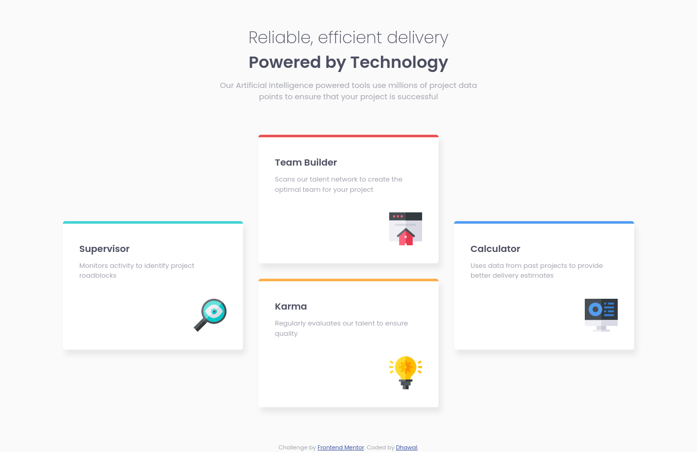

# :star2: Frontend Mentor - Four Card Feature Section :star2:

This is a solution to the [Four card feature section challenge on Frontend Mentor](https://www.frontendmentor.io/challenges/four-card-feature-section-weK1eFYK). Frontend Mentor challenges help you improve your coding skills by building realistic projects. 

### :point_right: [Live Site](https://dhawalrath.github.io/four-card-feature-section/)

## :camera: Overview

## :muscle: Built With

- HTML5 Semantics
- CSS3 (with Grid and Flexbox)
- SCSS

## :man: Author

- Frontend Mentor - [@dhawalRath](https://www.frontendmentor.io/profile/dhawalRath)
- Twitter - [@dhawalRath](https://www.twitter.com/dhawalRath)
