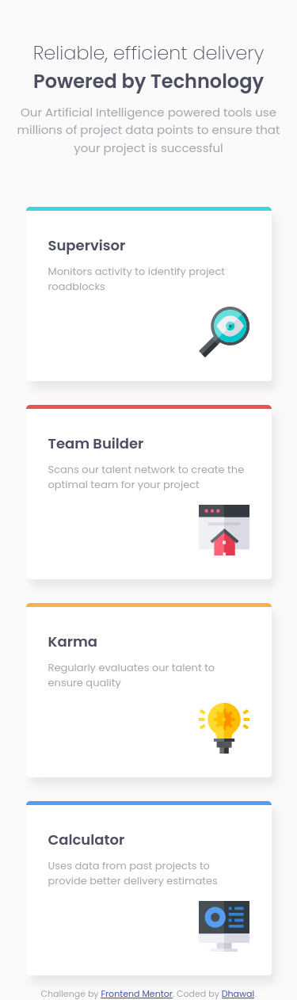

# Frontend Mentor - Four card feature section solution

This is a solution to the [Four card feature section challenge on Frontend Mentor](https://www.frontendmentor.io/challenges/four-card-feature-section-weK1eFYK). Frontend Mentor challenges help you improve your coding skills by building realistic projects. 

## Table of contents

- [Overview](#overview)
  - [Screenshot](#screenshot)
  - [Links](#links)
- [My process](#my-process)
  - [Built with](#built-with)
  - [What I learned](#what-i-learned)
- [Author](#author)

## Overview

### Screenshot

### Links

- Live Site URL: [view here](https://dhawalrath.github.io/four-card-feature-section/)

## My process

By observing the design I try to visualize number of contianers required and accordingly I choose Grid, Flexbox or both.

### Built with

- Semantic HTML5 markup
- SCSS
- Flexbox
- Grid

## Author

- Frontend Mentor - [@dhawalRath](https://www.frontendmentor.io/profile/dhawalRath)
- Twitter - [@dhawalRath](https://www.twitter.com/dhawalRath)
